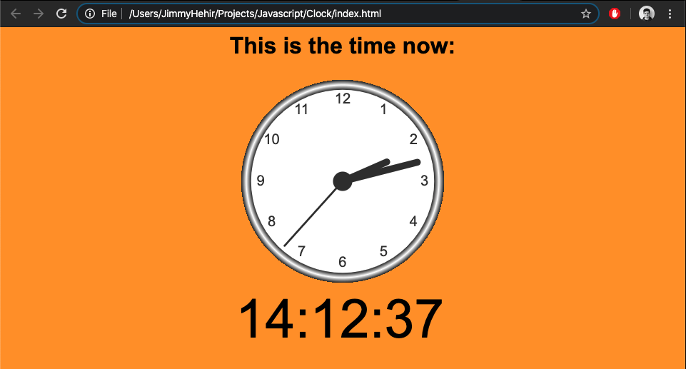

# Javascript Clock
> This is a mini project that showcases javascript to display an analog clock and digital clock

## Table of contents
* [General info](#general-info)
* [Screenshots](#screenshots)
* [Technologies](#technologies)
* [Setup](#setup)

## General info
The index.html file loads both scripts (clock.js & digtial.js). This displays the analog clock followed by a digital clock in 24hr format.

## Screenshots

## Technologies
* Javascript
* HTML
* CSS

## Setup
Clone this repo and run index.html in your preferred browser.
